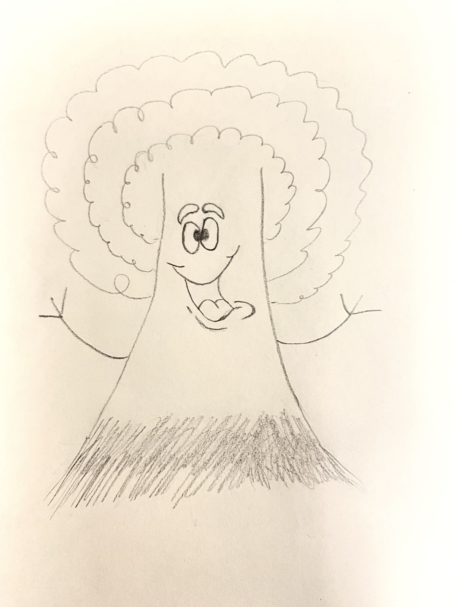
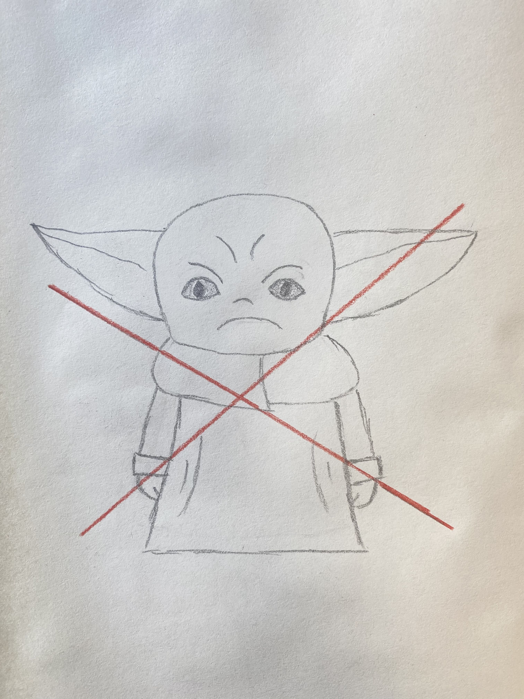
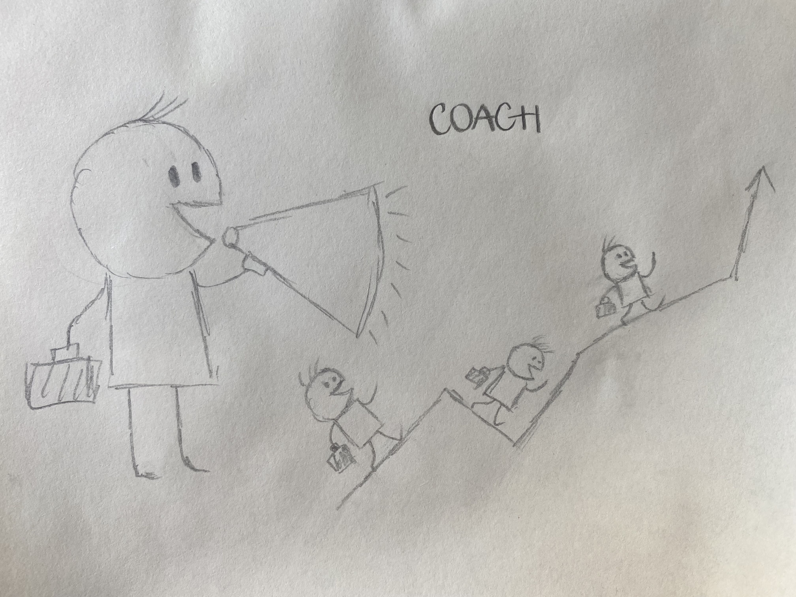
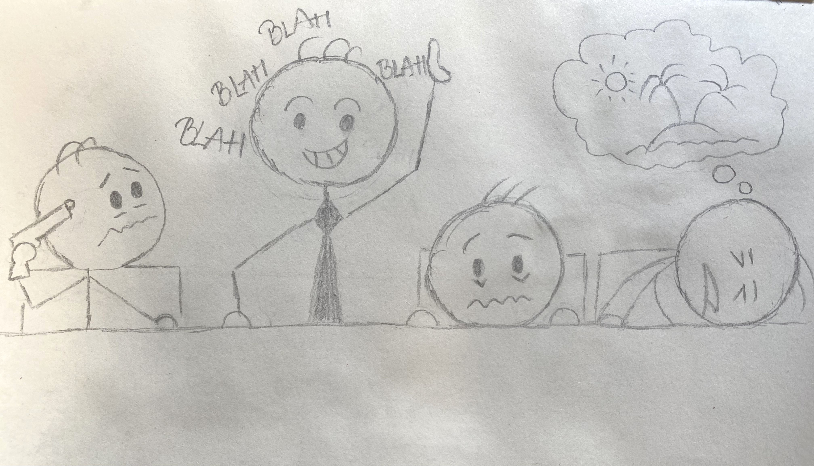

# Reinventing Organization Presentation.

By Tracy Le

<!-- .slide: data-background="./maintheme2.jpg" -->

---

## Agenda

1. Overview of different types of organization

1. Introduction of Reinventing organization

1. Structure of Reinventing organization

<!-- .slide: data-background="./maintheme7.png" -->

---

### 
 1. Overview of different types of organization 

- Red

- Amber

- Orange

- Green

- Teal (Reinventing organization)

<!-- .slide: data-background="./maintheme7.png" -->

---

 a. Red organization 

- Power

- Fear

- Top-down authority

- Division of labour

<!-- .slide: data-background="./redtheme.jpg" -->

---

 b. Amber organization 

- Hierarchy

- Stability

- Control

<!-- .slide: data-background="./ambertheme4.jpg" -->

---

 c. Orange  organization 

- Innovation

- Accountability

- Meritocracy

<!-- .slide: data-background="./orangetheme2.jpg" -->

---

  d. Green  organization 

- Empowerment

- Values-driven culture

- Stakeholders

<!-- .slide: data-background="./greentheme3.jpg" -->

---

### 
 2. Introduction of Reinventing organization 

- Self-management

- Wholeness

- Evolutionary purpose

<!-- .slide: data-background="./tealtheme3.jpg" -->

---

### 
 3. Structure of Reinventing organization 

<!-- .slide: data-background="./maintheme7.png" -->

- Self-management teams

- No boss

- No middle management

- Few meetings

<!-- .slide: data-background="./maintheme7.png" -->

---

 a. Self-management teams 

## <!-- .slide: data-background="./maintheme7.png" -->

---

 b. No boss 

<!-- .slide: data-background="./maintheme7.png" -->

---

 c. No middle management 

<!-- .slide: data-background="./maintheme7.png" -->

---

 d.  Few meetings 

<!-- .slide: data-background="./maintheme7.png" -->

---

### 
 References 

- Lalous, F. (2014). _Reinventing Organization. A guide to creating organizations inspired by the next stage of human consciousness._ Nelson Parker.

- Lalous, F. (2016). _Reinventing Organization. An illustrated invitation to join the conversation on next-stage organizations._ Nelson Parker.

<!-- .slide: data-background="./maintheme7.png" -->

---
