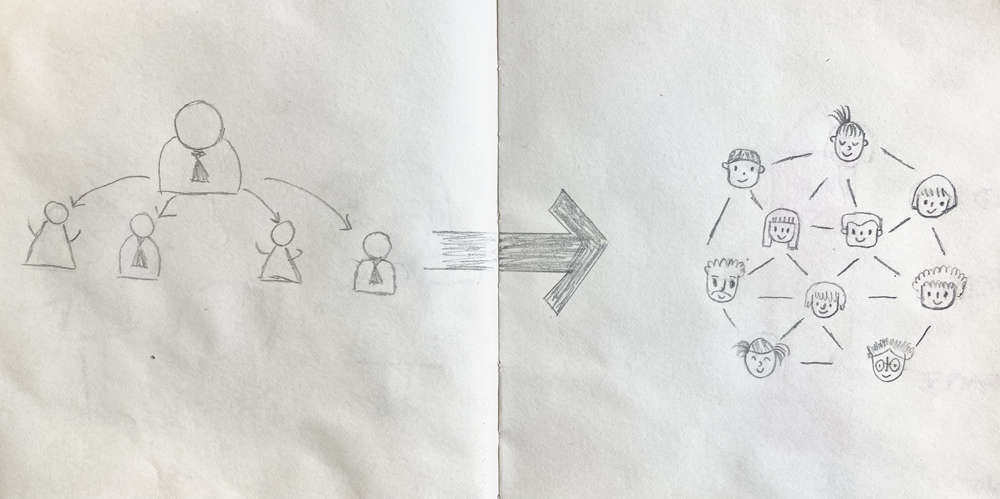

- Parallel teams

- Web of individual contracting

- Nested teams

---

# Draft

### 1. Introduction of Reinventing organization

 a. Types of organization 

a. Types of organizations 

  

---

## Teal

 2. Teal  organization (Reinventing organization) 

##  |

## 

| Characteristics | Red | Amber | Orange | Green | Teal |
| :-------------- | :-- | :---- | :----- | :---- | ---- |
| abc             | abc | abc   | abc    | abc   |      |

Picture: Red - Amber - Organge - Green

---

> _You never change things by fighting the existing reality. To change something, build a new model that makes the existing model obsolete._

> _Richard Buckminster Fuller_

---

### Reinventing organization

---

## Structure of Teal organizations - How do Teal organizations work?

 c. No middle management 

## 
 d. Few meetings 

## Limitations of Teal organizations

## Examples of Teal organizations

Buurtzorg

 Lalous, F. (2014). *Reinventing Organization. A guide to creating organizations inspired by the next stage of human consciousness.* Nelson Parker.

